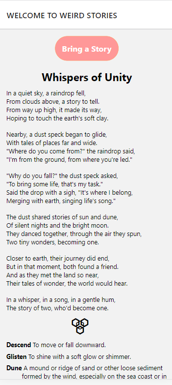

# Weird Stories: Revel in the Uncanny! 📖✨

Welcome to **Weird Stories**—a unique collection of tales so peculiar they defy the ordinary. Dive deep into eerie realms and meet creatures and events that go beyond the mundane. Crafted for adventurous souls, night owls, and cerebral thinkers.



## Features 🌟

- **Unique Content:** Distinctive stories you won't find anywhere else.
- **Mood Enhancer:** Perfect for late-night reads or mood uplifters.
- **Mental Exercise:** Engage in tales that stimulate the brain and challenge conventional thinking.
- **Convenient Reading:** Designed for readers on-the-go.

## Target Audience 🎯

- **Adventurous Souls:** Tired of clichéd narratives? Seek a refreshing escape.
- **Night Owls:** Find solace in tales during those sleepless nights.
- **Cerebral Thinkers:** Relish dissecting narratives and diving deep into symbolic meanings.

## Benefits 🌱

- **Stoke Creativity:** Boost your imagination with unconventional narratives.
- **Expand Horizons:** Challenge societal norms and gain a broadened perspective.
- **Learn New Words:** Enhance your vocabulary with rich language.

## Installation 📲

```bash
git clone https://github.com/abdulhakim-altunkaya/react_native_english_stories.git
cd WeirdStories
npm install
npm start
```

## Contributing 🤝

Feel free to contribute to this project. Fork, clone, make your changes, and then submit a pull request. For major changes, please open an issue first.

## Tags 🏷️

`#WeirdStories` `#ReactNative` `#MobileReading` `#UncannyTales` `#Adventure` `#NightReads` `#MentalStimulation`

<a target="_blank" href="https://icons8.com/icon/zbDIEnbU2OTz/scary-tree">Scary Tree</a> icon by <a target="_blank" href="https://icons8.com">Icons8</a>